# AgentOS Project Health

Auditor de saúde para repositórios: verifica documentação, licença, `.gitignore`, CI, testes, segurança e contribuição, gerando nota e plano de ação sem dependências externas.

```bash
python health.py caminho/do/projeto
python health.py . --json
python health.py . --minimum 80
```

O parâmetro `--minimum` permite criar uma barreira de qualidade em CI. Ideal para automação, ensino e preparação de projetos open source. Projeto AgentOStudio · Licença MIT.
